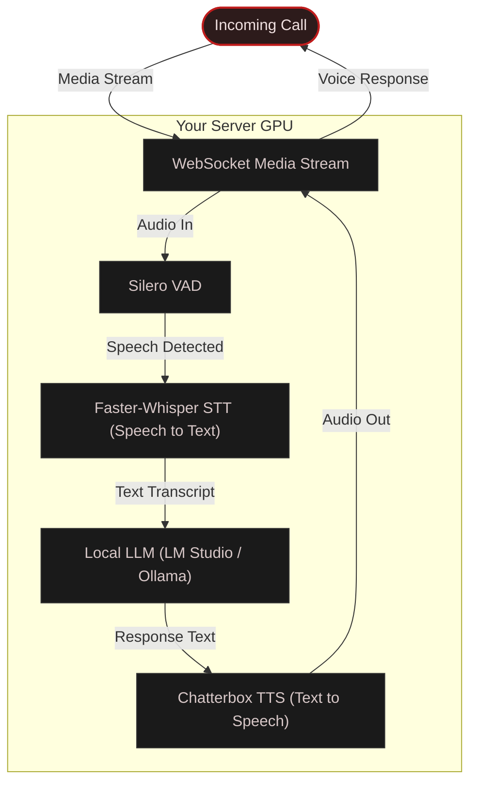

# HAL Answering Service

**A fully local AI phone screener.** Answers your calls as HAL 9000, screens callers, records conversations, and sends you a push notification with a summary and full transcript — all running on your own hardware.

Zero cloud AI. Zero per-minute billing. Your GPU handles everything: local LLM for conversation, local speech-to-text, and local text-to-speech with voice cloning.

## How it works



## Features

- **Fully local:** No cloud AI APIs, everything on your GPU.
- **Sub-second latency:** Best observed round-trip is **649ms**, fully local, with voice cloning.
- **Voice cloning:** Clone any voice from a 5-second WAV sample (Chatterbox Turbo).
- **Barge-in:** Caller can interrupt the AI mid-sentence, audio clears instantly.
- **Call recording:** Saves mixed mono WAV of both parties, accurately aligned.
- **Push notifications:** Call summary + full transcript via ntfy.
- **Call metadata:** JSON logs of every call with transcript and summary.
- **Pre-recorded greetings:** Instant pickup, no TTS delay.
- **Silence handling:** Prompts quiet callers, auto-hangs-up after repeated silence.
- **Security:** Webhook signature validation, input truncation, XML escaping, prompt injection hardening.
- **Customizable personality:** HAL 9000 is just the default. Change the system prompt in `prompts.py` and swap the voice WAV file to create any character you want.
- **Graceful demo mode:** Runs in browser-mic demo mode until you're ready to connect a phone line — no separate setup needed.

## Demo

HAL vs. a vehicle warranty scammer — both sides are fully live LLM, nothing is scripted. HAL wastes the caller's time with bureaucratic precision until Dave gives up:

<video src="https://github.com/user-attachments/assets/c27aabfe-299a-4a45-bbd8-843adfac2e37" controls></video>

## Quick start

```bash
git clone https://github.com/ninjahuttjr/hal-answering-service.git
cd hal-answering-service
```

**Windows:** `setup.bat` &nbsp;|&nbsp; **Linux/macOS:** `chmod +x setup.sh && ./setup.sh`

```bash
python main.py
```

That's it. On first run, HAL walks you through an interactive setup wizard that configures everything and writes a complete `.env` file. The wizard covers:

1. **Your name** — used in greetings ("You've reached _name_'s phone")
2. **LLM provider** — LM Studio, Ollama, or any OpenAI-compatible server
3. **SignalWire** — phone line credentials (skip to stay in demo mode)
4. **Public hostname** — for webhook delivery (skip for demo mode)
5. **Server settings** — bind address, port, TLS

If you skip SignalWire or the public hostname, HAL starts in **demo mode** automatically — talk to it through your browser at **http://localhost:8080/demo**. Fill in the missing fields in `.env` later and restart to go live. No re-setup needed.

> **You need a local LLM server running before you start.** Everything else — speech-to-text, text-to-speech, voice activity detection — runs locally with no cloud API.

> **Mic access:** Browsers require either `localhost` or HTTPS for microphone access. The demo auto-redirects LAN IPs to localhost. Use headphones to avoid echo feedback.

### Remote device testing

To test the demo on your phone or tablet, expose the server with a tunnel:

```bash
ngrok http 8080            # or: cloudflared tunnel --url http://localhost:8080
```

Visit the HTTPS URL on your device.

## Requirements

| Requirement | Details |
|---|---|
| **Python** | 3.12+ |
| **GPU** | Optional: NVIDIA CUDA recommended for best latency. CPU mode is supported (including macOS). |
| **VRAM** | 16 GB+ recommended for full GPU stack (Whisper large-v3-turbo + Chatterbox Turbo + Silero VAD ~ 6 GB, plus your LLM) |
| **SignalWire** | Account with a phone number ([signalwire.com](https://signalwire.com)) — $0.50/mo for a number, ~$0.007/min for inbound calls. **Not needed for demo mode.** |
| **Local LLM** | [LM Studio](https://lmstudio.ai), [Ollama](https://ollama.com), or any OpenAI-compatible API server |
| **Public endpoint** | HTTPS — via Tailscale Funnel, Cloudflare Tunnel, ngrok, etc. **Not needed for demo mode.** |

## Going live (production)

Once you're happy with HAL in demo mode, add the production fields to `.env` and restart:

| Field | Where to get it |
|---|---|
| `SIGNALWIRE_PROJECT_ID` | [SignalWire dashboard](https://signalwire.com) → Project Settings |
| `SIGNALWIRE_TOKEN` | SignalWire dashboard → API Tokens |
| `SIGNALWIRE_SPACE` | Your SignalWire space name (the subdomain) |
| `SIGNALWIRE_PHONE_NUMBER` | The number that receives calls (e.g. `+14155551234`) |
| `PUBLIC_HOST` | Your public HTTPS hostname, no `https://` (e.g. `caller.example.com`) |
| `OWNER_NAME` | Your name — used in greetings |

Then in the [SignalWire dashboard](https://signalwire.com), set your phone number's **incoming call webhook** to:

```
https://YOUR_PUBLIC_HOST/incoming-call
```

Make sure it's set to **POST** and the format is **XML**.

### Exposing your server

You need a public HTTPS endpoint forwarding to port 8080:

```bash
# Tailscale Funnel (easiest if you use Tailscale)
tailscale funnel 8080

# Cloudflare Tunnel
cloudflared tunnel --url http://localhost:8080

# ngrok
ngrok http 8080
```

Set `PUBLIC_HOST` in `.env` to the hostname you get (without `https://`).

> **Behind a reverse proxy?** Set `NO_TLS=1` in `.env` to disable HAL's auto-generated Tailscale TLS certificates. The tunnel handles encryption — running TLS on both sides causes 502 errors.

<details>
<summary>Detailed setup guide</summary>

### Install dependencies

Run the setup script for your platform. It will:
- Create a Python virtual environment
- Auto-detect your NVIDIA GPU and install the right PyTorch build (CUDA or CPU)
- Install `chatterbox-tts` with `--no-deps` (the PyPI package has broken dependency pins)
- Install all other dependencies
- Verify that everything imports correctly

Important: run setup as your normal user (no `sudo`). Running with `sudo` can create a root-owned `venv` and break later installs.

Override CUDA version if needed:

| Command | CUDA version |
|---|---|
| `setup.bat cu128` / `./setup.sh cu128` | CUDA 12.8 (RTX 50-series) |
| `setup.bat cu124` / `./setup.sh cu124` | CUDA 12.4 (RTX 40-series) |
| `setup.bat cu121` / `./setup.sh cu121` | CUDA 12.1 |
| `setup.bat cpu` / `./setup.sh cpu` | CPU only (no GPU) |

<details>
<summary>Manual install (without setup script)</summary>

**Windows:**
```powershell
python -m venv venv
venv\Scripts\activate

# Install PyTorch with CUDA (see https://pytorch.org/get-started/locally/)
pip install torch torchaudio --index-url https://download.pytorch.org/whl/cu124

# Install chatterbox-tts without its broken deps (must be >=0.1.5)
pip install --no-deps "chatterbox-tts>=0.1.5"

# Install everything else
pip install -r requirements.txt
```

**Linux / macOS:**
```bash
python3 -m venv venv
source venv/bin/activate

# Install PyTorch (macOS / CPU default):
pip install torch torchaudio

# If you're on NVIDIA Linux, use CUDA wheels instead:
# pip install torch torchaudio --index-url https://download.pytorch.org/whl/cu124

# Install chatterbox-tts without its broken deps (must be >=0.1.5)
pip install --no-deps 'chatterbox-tts>=0.1.5'

# Install everything else
pip install -r requirements.txt
```

**Important:** `chatterbox-tts` must be version 0.1.5 or later. Earlier versions are missing the `chatterbox.tts_turbo` module and will crash on startup.

</details>

### Start your local LLM

Choose one:

- **LM Studio**: open [LM Studio](https://lmstudio.ai), load a model, and start the local server at `http://127.0.0.1:1234/v1`.
- **Ollama**: run `ollama serve` and use `LLM_BASE_URL=http://127.0.0.1:11434/v1`.
- **Other**: any OpenAI-compatible API endpoint is supported.

Recommended models: anything fast with good instruction following. The default is `zai-org/glm-4.7-flash`.

### Bundle Chatterbox Weights (offline onboarding)

To avoid runtime model downloads, ship a local model bundle and point HAL at it:

```bash
# Download once into a distributable local folder
python scripts/prefetch_chatterbox.py --output models/chatterbox
```

Set one of:
- `TTS_MODEL_DIR=models/chatterbox` in `.env`, or
- leave `TTS_MODEL_DIR` unset and place files in `models/chatterbox` (auto-detected).

Required files in the bundle directory:
- `ve.safetensors`
- `t3_turbo_v1.safetensors`
- `s3gen_meanflow.safetensors`
- tokenizer files (`tokenizer.json`, `tokenizer_config.json`, etc.)

When the bundle is present, HAL loads TTS fully local and does not call Hugging Face.

</details>

## Call data

- Recordings are saved as WAV files in the `recordings/` directory
- Call metadata (transcript, summary, caller info) is stored as JSON in the `metadata/` directory
- `GET /health` returns `{"status": "ok"}` for uptime monitoring

## Voice cloning

Chatterbox Turbo can clone any voice from a short reference recording:

1. Record a **5+ second** WAV of the target voice (clean audio, minimal background noise).
2. Set `TTS_VOICE_PROMPT=/path/to/your/sample.wav` in `.env`.
3. Restart the server.

Two sample voices are included: `hal9000.wav` and `eugene.wav`.

<details>
<summary>Call forwarding setup</summary>

You probably don't want every call going to an AI. Here's how I use it:

**Conditional forwarding (Verizon):** Dial `*71` followed by your SignalWire number. This only forwards calls you don't answer, so if you don't pick up it goes to HAL instead of voicemail. Other carriers have similar codes.

**Unknown callers only (iPhone):** Set up a Focus Mode that silences unknown numbers. Those calls go straight to HAL automatically while known contacts still ring through normally.

</details>

<details>
<summary>Latency benchmarks</summary>

End-to-end latency from the caller finishing their sentence to hearing the AI respond runs under 1.5 seconds in typical conversation. Best observed round-trip is **649ms**, fully local, with voice cloning.

### Benchmarks (RTX 5090, glm-4.7-flash, Whisper large-v3-turbo)

Measured across 15 conversational exchanges over 3 live phone calls:

| Stage | Best | Typical | Worst |
|---|---|---|---|
| STT (Faster-Whisper) | 63 ms | 200–300 ms | 424 ms |
| LLM (time to first sentence) | 162 ms | 180–280 ms | 846 ms |
| TTS (Chatterbox Turbo, first chunk) | 345 ms | 500–850 ms | 1560 ms |
| **End-to-end** | **649 ms** | **~1.0–1.5 s** | **~2.8 s** |

> **Note:** These times start from when the VAD detects the caller has stopped speaking. The "worst" numbers are from the first exchange of a call when caches are cold.

### Why it feels fast

- **Sentence-level streaming:** The LLM streams its response and TTS synthesizes each sentence as it arrives.
- **Pre-recorded greetings:** The initial pickup is instant. Greetings are synthesized at startup and played from memory.
- **Barge-in:** If the caller interrupts, audio clears instantly and the pipeline restarts.
- **GPU concurrency:** STT, LLM, and TTS all run concurrently on GPU.

### Hardware used for these benchmarks

| Component | Details |
|---|---|
| GPU | NVIDIA RTX 5090 (32 GB VRAM) |
| LLM | zai-org/glm-4.7-flash via LM Studio (thinking disabled) |
| STT | Faster-Whisper large-v3-turbo (float16) |
| TTS | Chatterbox Turbo with HAL 9000 voice clone |
| VAD | Silero VAD (400ms silence threshold) |

</details>

## Project structure

| File | Purpose |
|---|---|
| `main.py` | Entry point — setup wizard, loads models, pre-records greetings, starts server |
| `server.py` | FastAPI app — webhook, WebSocket media stream, demo endpoints, ntfy notifications |
| `demo_ui.py` | Native FastAPI demo UI — HTML template for the HAL eye, Call status, and logs |
| `call_handler.py` | Per-call pipeline — VAD, STT, LLM, TTS, barge-in, recording |
| `audio.py` | G.711 mu-law codec, resampling, Silero VAD wrapper |
| `stt.py` | Faster-Whisper speech-to-text |
| `tts.py` | Chatterbox Turbo text-to-speech with voice cloning |
| `llm.py` | OpenAI-compatible LLM client with streaming sentence extraction |
| `prompts.py` | HAL 9000 system prompt, greetings, summary prompt |
| `config.py` | Dataclass config from environment variables |

<details>
<summary>Configuration reference</summary>

All settings are configured via environment variables (`.env` file). On first run, `python main.py` launches a setup wizard that writes a complete `.env` with every field. Optional fields are included as comments with their defaults.

| Variable | Default | Description |
|---|---|---|
| **SignalWire** | | *Required for live calls, not needed for demo* |
| `SIGNALWIRE_PROJECT_ID` | *(none)* | Project ID from dashboard |
| `SIGNALWIRE_TOKEN` | *(none)* | API token |
| `SIGNALWIRE_SPACE` | *(none)* | Space name |
| `SIGNALWIRE_PHONE_NUMBER` | *(none)* | Phone number for inbound calls |
| `SIGNALWIRE_SIGNING_KEY` | *(uses token)* | Webhook signing key |
| **Server** | | |
| `HOST` | `127.0.0.1` | Bind address (`0.0.0.0` for all interfaces) |
| `PORT` | `8080` | Bind port |
| `PUBLIC_HOST` | *(none)* | Public hostname for WebSocket URL |
| `NO_TLS` | *(off)* | Set to `1` to disable auto TLS (use behind reverse proxy) |
| `MAX_CONCURRENT_CALLS` | `3` | Max simultaneous calls |
| `MAX_CALL_DURATION_S` | `600` | Max call length in seconds |
| **STT** | | |
| `STT_MODEL` | `large-v3-turbo` | Faster-Whisper model size |
| `STT_DEVICE` | `auto` | `auto`, `cuda`, or `cpu` |
| `STT_COMPUTE_TYPE` | `auto` | `auto`, `float16`, `int8`, etc. |
| `STT_LANGUAGE` | `en` | Language hint (`""` to auto-detect) |
| `STT_BEAM_SIZE` | `1` | Beam width (higher can improve accuracy, slower) |
| `STT_BEST_OF` | `1` | Number of sampled candidates |
| `STT_NO_SPEECH_THRESHOLD` | `0.6` | Probability threshold for no-speech |
| `STT_LOG_PROB_THRESHOLD` | `-1.0` | Minimum log-prob threshold |
| `STT_CONDITION_ON_PREVIOUS_TEXT` | `false` | Use previous text as decoding context |
| `STT_INITIAL_PROMPT` | `Phone call screening conversation.` | Initial prompt for decoder |
| **LLM** | | |
| `LLM_PROVIDER` | `auto` | `auto`, `lmstudio`, `ollama`, or `openai_compatible` |
| `LLM_BASE_URL` | `http://127.0.0.1:1234/v1` | OpenAI-compatible API endpoint |
| `LLM_API_KEY` | `lm-studio` | API key (LM Studio ignores this) |
| `LLM_MODEL` | *(server default)* | Model name |
| `LLM_MAX_TOKENS` | `200` | Max response tokens |
| `LLM_TEMPERATURE` | `0.7` | Sampling temperature |
| `LLM_FREQUENCY_PENALTY` | `0.0` | Repetition penalty |
| **TTS** | | |
| `HF_TOKEN` | *(none)* | Optional Hugging Face token for model download auth/rate limits |
| `TTS_MODEL_DIR` | *(none)* | Local pre-downloaded Chatterbox model directory |
| `TTS_DEVICE` | `auto` | `auto`, `cuda`, or `cpu` |
| `TTS_VOICE_PROMPT` | `hal9000.wav` | Path to voice cloning WAV (>5s) |
| **VAD** | | |
| `VAD_SPEECH_THRESHOLD` | `0.5` | Silero speech probability threshold |
| `VAD_SILENCE_THRESHOLD_MS` | `400` | Silence duration to end utterance |
| `VAD_MIN_SPEECH_MS` | `250` | Min speech duration to be real |
| **Other** | | |
| `OWNER_NAME` | *(none)* | Your name (used in greetings) |
| `RECORDINGS_DIR` | `recordings` | Where call WAVs are saved |
| `METADATA_DIR` | `metadata` | Where call metadata JSON is saved |
| `NTFY_TOPIC` | *(none)* | ntfy.sh topic for notifications |
| `NTFY_TOKEN` | *(none)* | Bearer token for authenticated ntfy topics |

</details>

## Troubleshooting

| Problem | Fix |
|---|---|
| `ModuleNotFoundError: No module named 'chatterbox.tts_turbo'` | `chatterbox-tts` is too old. Run: `pip install --no-deps "chatterbox-tts>=0.1.5"` |
| `Permission denied` under `venv/.../site-packages` | You likely ran setup with `sudo`. Fix with `sudo rm -rf venv` then rerun `./setup.sh` as your normal user. |
| Demo mic doesn't work / no audio | Browsers require `localhost` or HTTPS for mic access. Use `http://localhost:8080/demo` (not a LAN IP). |
| PyTorch CUDA not available after install | If you're on macOS/CPU this is expected: keep `STT_DEVICE=auto` and `TTS_DEVICE=auto`. If you're on NVIDIA, reinstall CUDA PyTorch: `pip install torch torchaudio --index-url https://download.pytorch.org/whl/cu124` |
| Chatterbox model download fails without auth | Prefer shipping a local bundle (`TTS_MODEL_DIR` or `models/chatterbox`). Otherwise set `HF_TOKEN` in `.env` or run `hf auth login`, then restart. |
| Slow responses in CPU mode | Set `STT_MODEL=base` and `STT_COMPUTE_TYPE=int8`, and use a smaller local LLM model. |
| `CUDA out of memory` | Use a smaller STT model (`STT_MODEL=base`) or lower precision (`STT_COMPUTE_TYPE=int8`). |
| Connection refused on port 1234/11434 | Start your LLM server first (`LM Studio` on 1234 or `Ollama` on 11434), then run `python main.py`. |
| 502 errors behind Cloudflare Tunnel / ngrok | Set `NO_TLS=1` in `.env` — HAL auto-generates Tailscale TLS certs which conflict with tunnel encryption. |
| HAL starts in demo mode unexpectedly | Check `python main.py` log output — it lists exactly which production fields are missing. Fill them in `.env` and restart. |

## Acknowledgments

- [Chatterbox TTS](https://github.com/resemble-ai/chatterbox) by Resemble AI — voice cloning
- [Faster-Whisper](https://github.com/SYSTRAN/faster-whisper) — CTranslate2 Whisper implementation
- [Silero VAD](https://github.com/snakers4/silero-vad) — voice activity detection
- [FastAPI](https://fastapi.tiangolo.com/) — web framework and WebSocket connections
- [SignalWire](https://signalwire.com) — telephony
- [LM Studio](https://lmstudio.ai) — local LLM server
- [Ollama](https://ollama.com) — local LLM runtime
- [ntfy](https://ntfy.sh) — push notifications

## License

[MIT](LICENSE)
